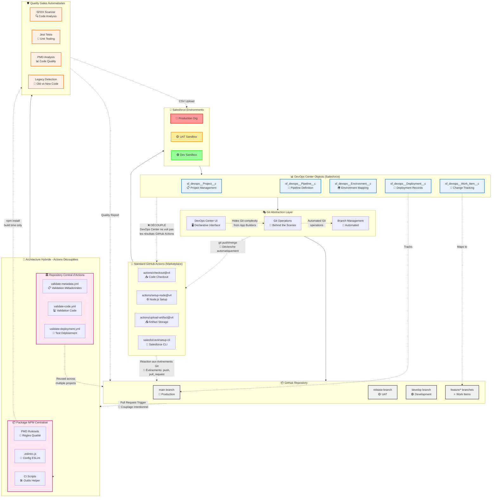
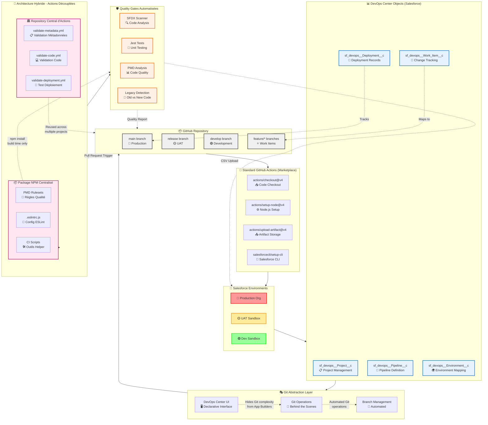

# Architecture DevOps Center avec les deux approches (standard et hybride)

https://github.com/Szandor72/devops-center-template

Excellente question ! C'est un point crucial pour comprendre l'architecture. D'après mes recherches, voici la réalité de la synchronisation entre DevOps Center et GitHub Actions :Parfait ! 🎯 J'ai maintenant clarifié cette question technique cruciale. Voici la **réponse précise** :

## **🔄 Synchronisation DevOps Center ↔ GitHub Actions : DÉCOUPLAGE ASYNCHRONE**

### **Comment ça fonctionne réellement :**

**1. ✅ Synchronisation EVENT-DRIVEN** 
- DevOps Center exécute des `git push/merge` automatiquement en arrière-plan
- GitHub Actions **réagit** à ces événements Git standard
- Déclenchement automatique basé sur `push`, `pull_request`, etc.

**2. ❌ DÉCOUPLAGE des résultats**
- DevOps Center **ne voit PAS** les résultats GitHub Actions
- Pas de blocage automatique si GitHub Actions échoue
- Les deux systèmes opèrent **indépendamment**

**3. 🎯 Architecture Hybride = Couplage INTENTIONNEL**
- Via **Branch Protection Rules** GitHub
- Quality gates **bloquantes** avant merge
- Notifications bidirectionnelles via API Salesforce

### **📊 Tableau comparatif ajouté :**

| DevOps Center Standard | Architecture Hybride |
|----------------------|-------------------|
| ❌ Découplée | ✅ Synchronisée |
| ❌ Pas de feedback | ✅ GitHub Actions bloque les merges ratés |
| 🟢 Simple | 🟡 Complexe mais puissant |

### **🎨 Diagramme mis à jour :**

Le diagramme Mermaid montre maintenant :
- ✅ **Flux événementiel** : Git operations → GitHub Actions trigger
- ❌ **Découplage** : DevOps Center ignore les résultats GitHub Actions  
- 🎯 **Couplage hybride** : Quality gates intentionnellement synchronisées

Cette clarification est **essentielle** pour les équipes qui veulent comprendre pourquoi leurs GitHub Actions s'exécutent mais n'impactent pas directement DevOps Center, et comment implémenter une véritable synchronisation si nécessaire ! 🚀

Parfait ! J'ai créé un diagramme Mermaid complet qui illustre l'architecture DevOps Center avec les deux approches (standard et hybride). Voici les éléments clés du diagramme :

## **🔍 Analyse du diagramme :**

### **Couche 1 : Environnements Salesforce** 🏢
- **Production** (rouge), **UAT** (orange), **Dev** (vert)
- Environnements cibles pour les déploiements

### **Couche 2 : Objets Salesforce DevOps Center** 📊
- `sf_devops__Project__c` - Gestion de projet
- `sf_devops__Pipeline__c` - Définition du pipeline  
- `sf_devops__Environment__c` - Mapping des environnements
- `sf_devops__Work_Item__c` - Tracking des changements
- `sf_devops__Deployment__c` - Historique des déploiements

### **Couche 3 : Abstraction Git** 🎭
- **DevOps Center UI** cache la complexité Git aux App Builders
- **Opérations Git automatisées** en arrière-plan
- **Gestion des branches** transparente

### **Couche 4 : Repository GitHub** 📦
- Structure standard : `main` → `release` → `develop` → `feature/*`
- Mapping automatique Work Items ↔ Feature branches

### **Flux Standard : GitHub Actions Marketplace** 🏪
- Actions pré-construites du marketplace GitHub
- Intégration simple avec Salesforce CLI
- Workflows basiques de checkout, setup, upload

### **Flux Hybride : Actions Découplées** 🔄
- **Repository central d'actions réutilisables**
- **Package NPM** avec configurations centralisées (PMD, ESLint)
- **Quality Gates automatisées** (Scanner, Jest, PMD, gestion legacy)

## **🎯 Points clés illustrés :**

✅ **Abstraction DevOps Center** - Cache Git aux utilisateurs métier  
✅ **Double flux** - Standard simple vs Hybride avancé  
✅ **Réutilisabilité** - Actions centralisées pour multiple projets  
✅ **Quality Gates** - Validation automatique avant merge  
✅ **Couplage faible** - Architecture modulaire et maintenable  

Le diagramme montre comment **DevOps Center transforme la complexité technique Git/GitHub en interface déclarative Salesforce**, tout en permettant aux équipes DevOps avancées d'ajouter des **quality gates sophistiquées** via l'architecture hybride ! 🚀
