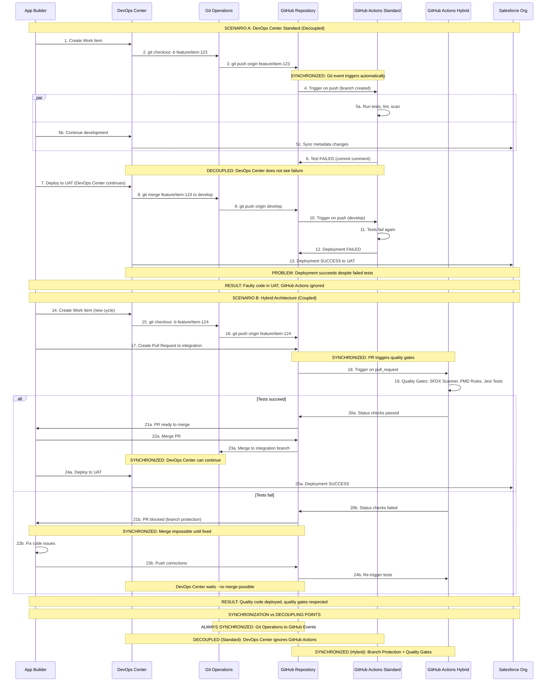
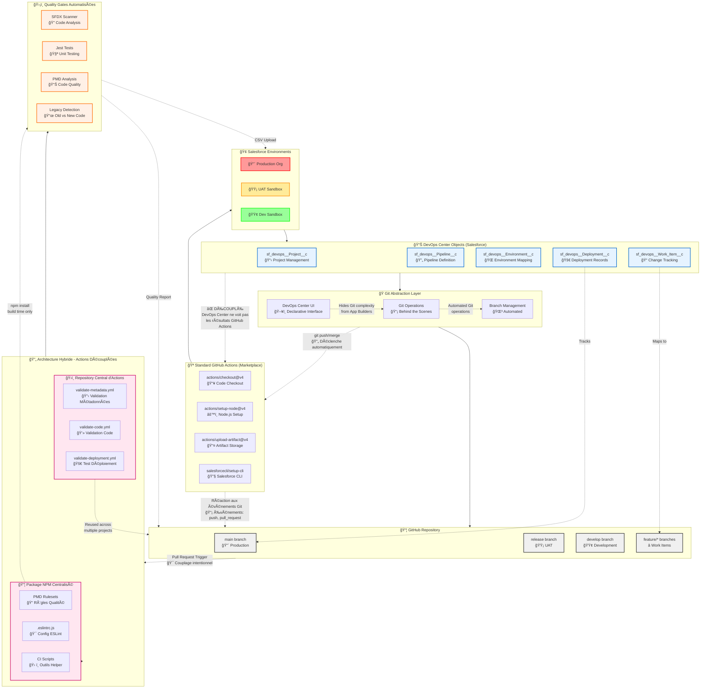
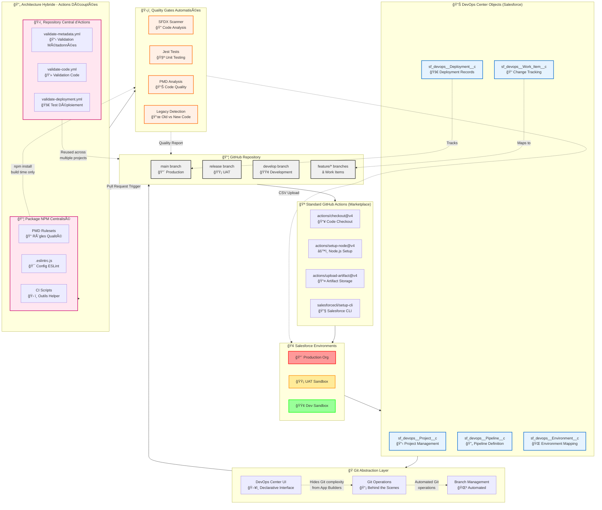

# Architecture DevOps Center avec les deux approches (standard et hybride)

https://github.com/Szandor72/devops-center-template

Excellente question ! C'est un point crucial pour comprendre l'architecture. D'après mes recherches, voici la réalité de la synchronisation entre DevOps Center et GitHub Actions :Parfait ! 🯠J'ai maintenant clarifié cette question technique cruciale. Voici la **réponse précise** :

## **🔄 Synchronisation DevOps Center ↔ GitHub Actions : DÉCOUPLAGE ASYNCHRONE**

### **Comment ça fonctionne réellement :**

**1. ✅ Synchronisation EVENT-DRIVEN** 
- DevOps Center exécute des `git push/merge` automatiquement en arrière-plan
- GitHub Actions **réagit** à ces événements Git standard
- Déclenchement automatique basé sur `push`, `pull_request`, etc.

**2. ⌠DÉCOUPLAGE des résultats**
- DevOps Center **ne voit PAS** les résultats GitHub Actions
- Pas de blocage automatique si GitHub Actions échoue
- Les deux systèmes opèrent **indépendamment**

**3. 🯠Architecture Hybride = Couplage INTENTIONNEL**
- Via **Branch Protection Rules** GitHub
- Quality gates **bloquantes** avant merge
- Notifications bidirectionnelles via API Salesforce

### **📊 Tableau comparatif ajouté :**

| DevOps Center Standard | Architecture Hybride |
|----------------------|-------------------|
| ⌠Découplée | ✅ Synchronisée |
| ⌠Pas de feedback | ✅ GitHub Actions bloque les merges ratés |
| 🟢 Simple | 🟡 Complexe mais puissant |

### **🨠Diagramme mis à jour :**

Le diagramme Mermaid montre maintenant :
- ✅ **Flux événementiel** : Git operations → GitHub Actions trigger
- ⌠**Découplage** : DevOps Center ignore les résultats GitHub Actions  
- 🯠**Couplage hybride** : Quality gates intentionnellement synchronisées

Cette clarification est **essentielle** pour les équipes qui veulent comprendre pourquoi leurs GitHub Actions s'exécutent mais n'impactent pas directement DevOps Center, et comment implémenter une véritable synchronisation si nécessaire ! 🚀

Parfait ! 🯠J'ai créé un diagramme de séquence détaillé qui visualise **exactement** les points de synchronisation et de découplage entre DevOps Center et GitHub Actions.

## **🔠Points clés du diagramme :**

### **🔵 Scénario A : DevOps Center Standard (Découplé)**
- **Étapes 1-13** : Workflow normal DevOps Center
- **Problème critique** : Tests GitHub Actions échouent (étapes 6, 12) mais DevOps Center déploie quand même (étape 13)
- **Résultat** : Code défaillant en production malgré les quality gates ratées

### **🟢 Scénario B : Architecture Hybride (Couplé)**  
- **Étapes 14-25** : Quality gates bloquantes
- **Point de synchronisation** : Pull Request + Branch Protection Rules
- **Résultat** : Impossible de merger tant que les tests n'ont pas réussi

### **📊 Visualisation des synchronisations :**

| Zone | Statut | Explication |
|------|--------|-------------|
| 🟨 **Git → GitHub** | ✅ **TOUJOURS SYNCHRONISÉ** | Événements Git déclenchent automatiquement GitHub Actions |
| 🟥 **DevOps Center ↠GitHub Actions** | ⌠**DÉCOUPLÉ (Standard)** | DevOps Center ignore complètement les résultats |
| 🟩 **Branch Protection + Quality Gates** | ✅ **SYNCHRONISÉ (Hybride)** | Merge impossible si tests échouent |

### **⚡ Timing critique illustré :**

- **Standard** : DevOps Center et GitHub Actions s'exécutent **en parallèle** sans communication
- **Hybride** : GitHub Actions **bloque** DevOps Center jusqu'à validation complète

Ce diagramme montre parfaitement pourquoi l'architecture hybride est essentielle pour éviter les déploiements de code défaillant, et comment les quality gates créent une **synchronisation forcée** là où DevOps Center seul reste aveugle aux problèmes détectés par GitHub Actions ! 🚀

Parfait ! J'ai créé un diagramme Mermaid complet qui illustre l'architecture DevOps Center avec les deux approches (standard et hybride). Voici les éléments clés du diagramme :

## **🔠Analyse du diagramme :**

### **Couche 1 : Environnements Salesforce** ğŸ¢
- **Production** (rouge), **UAT** (orange), **Dev** (vert)
- Environnements cibles pour les déploiements

### **Couche 2 : Objets Salesforce DevOps Center** 📊
- `sf_devops__Project__c` - Gestion de projet
- `sf_devops__Pipeline__c` - Définition du pipeline  
- `sf_devops__Environment__c` - Mapping des environnements
- `sf_devops__Work_Item__c` - Tracking des changements
- `sf_devops__Deployment__c` - Historique des déploiements

### **Couche 3 : Abstraction Git** ğŸ­
- **DevOps Center UI** cache la complexité Git aux App Builders
- **Opérations Git automatisées** en arrière-plan
- **Gestion des branches** transparente

### **Couche 4 : Repository GitHub** 📦
- Structure standard : `main` → `release` → `develop` → `feature/*`
- Mapping automatique Work Items ↔ Feature branches

### **Flux Standard : GitHub Actions Marketplace** ğŸª
- Actions pré-construites du marketplace GitHub
- Intégration simple avec Salesforce CLI
- Workflows basiques de checkout, setup, upload

### **Flux Hybride : Actions Découplées** 🔄
- **Repository central d'actions réutilisables**
- **Package NPM** avec configurations centralisées (PMD, ESLint)
- **Quality Gates automatisées** (Scanner, Jest, PMD, gestion legacy)

## **🯠Points clés illustrés :**

✅ **Abstraction DevOps Center** - Cache Git aux utilisateurs métier  
✅ **Double flux** - Standard simple vs Hybride avancé  
✅ **Réutilisabilité** - Actions centralisées pour multiple projets  
✅ **Quality Gates** - Validation automatique avant merge  
✅ **Couplage faible** - Architecture modulaire et maintenable  

Le diagramme montre comment **DevOps Center transforme la complexité technique Git/GitHub en interface déclarative Salesforce**, tout en permettant aux équipes DevOps avancées d'ajouter des **quality gates sophistiquées** via l'architecture hybride ! 🚀
