# Architecture DevOps Center avec les deux approches (standard et hybride)

```mermaid
flowchart TB
    %% Salesforce Orgs Layer
    subgraph SF_ORGS["🢠Salesforce Environments"]
        PROD["🔴 Production Org"]
        UAT["🟡 UAT Sandbox"]
        DEV["🟢 Dev Sandbox"]
    end

    %% DevOps Center Objects Layer
    subgraph DC_OBJECTS["📊 DevOps Center Objects (Salesforce)"]
        PROJECT["sf_devops__Project__c<br/>📋 Project Management"]
        PIPELINE["sf_devops__Pipeline__c<br/>🔄 Pipeline Definition"]
        ENVIRONMENT["sf_devops__Environment__c<br/>🌠Environment Mapping"]
        WORKITEM["sf_devops__Work_Item__c<br/>📠Change Tracking"]
        DEPLOYMENT["sf_devops__Deployment__c<br/>🚀 Deployment Records"]
    end

    %% Git Abstraction Layer
    subgraph GIT_ABSTRACT["🭠Git Abstraction Layer"]
        DC_UI["DevOps Center UI<br/>ğŸ–¥ï¸ Declarative Interface"]
        GIT_OPS["Git Operations<br/>📡 Behind the Scenes"]
        BRANCH_MGMT["Branch Management<br/>🌳 Automated"]
    end

    %% GitHub Repository
    subgraph GITHUB["📦 GitHub Repository"]
        MAIN["main branch<br/>🔴 Production"]
        RELEASE["release branch<br/>🟡 UAT"]
        DEVELOP["develop branch<br/>🟢 Development"]
        FEATURE["feature/* branches<br/>â­ Work Items"]
    end

    %% Standard GitHub Actions (Marketplace)
    subgraph STANDARD_ACTIONS["🪠Standard GitHub Actions (Marketplace)"]
        CHECKOUT["actions/checkout@v4<br/>📥 Code Checkout"]
        SETUP_NODE["actions/setup-node@v4<br/>âš™ï¸ Node.js Setup"]
        UPLOAD_ARTIFACT["actions/upload-artifact@v4<br/>📤 Artifact Storage"]
        SF_CLI["salesforcecli/setup-cli<br/>🔧 Salesforce CLI"]
    end

    %% Hybrid Architecture - Loosely Coupled Actions
    subgraph HYBRID_ARCH["🔄 Architecture Hybride - Actions Découplées"]
        subgraph CENTRAL_REPO["ğŸ›ï¸ Repository Central d'Actions"]
            REUSABLE_META["validate-metadata.yml<br/>📋 Validation Métadonnées"]
            REUSABLE_CODE["validate-code.yml<br/>💻 Validation Code"]
            REUSABLE_DEPLOY["validate-deployment.yml<br/>🚀 Test Déploiement"]
        end
        
        subgraph CONFIG_PKG["📦 Package NPM Centralisé"]
            PMD_RULES["PMD Rulesets<br/>📠Règles Qualité"]
            ESLINT_CONFIG[".eslintrc.js<br/>🯠Config ESLint"]
            CI_SCRIPTS["CI Scripts<br/>ğŸ› ï¸ Outils Helper"]
        end
    end

    %% Quality Gates
    subgraph QUALITY_GATES["ğŸ›¡ï¸ Quality Gates Automatisées"]
        SCANNER["SFDX Scanner<br/>🔠Code Analysis"]
        JEST["Jest Tests<br/>🧪 Unit Testing"]
        PMD["PMD Analysis<br/>📊 Code Quality"]
        LEGACY["Legacy Detection<br/>📜 Old vs New Code"]
    end

    %% Workflow Connections
    %% DevOps Center Standard Flow
    SF_ORGS --> DC_OBJECTS
    DC_OBJECTS --> GIT_ABSTRACT
    GIT_ABSTRACT --> GITHUB
    
    %% Standard Actions Integration
    GITHUB --> STANDARD_ACTIONS
    STANDARD_ACTIONS --> SF_ORGS
    
    %% Hybrid Architecture Flow
    GITHUB -.->|"Pull Request Trigger"| HYBRID_ARCH
    HYBRID_ARCH --> CONFIG_PKG
    HYBRID_ARCH --> QUALITY_GATES
    QUALITY_GATES -.->|"Quality Report"| GITHUB
    QUALITY_GATES -.->|"CSV Upload"| SF_ORGS
    
    %% DevOps Center abstracts Git complexity
    DC_UI -.->|"Hides Git complexity<br/>from App Builders"| GIT_OPS
    GIT_OPS -.->|"Automated Git<br/>operations"| BRANCH_MGMT
    
    %% Work Item to Branch mapping
    WORKITEM -.->|"Maps to"| FEATURE
    DEPLOYMENT -.->|"Tracks"| MAIN
    
    %% Cross-repository reuse
    CENTRAL_REPO -.->|"Reused across<br/>multiple projects"| GITHUB
    CONFIG_PKG -.->|"npm install<br/>build time only"| QUALITY_GATES

    %% Styling
    classDef prodStyle fill:#ff9999,stroke:#ff0000,stroke-width:2px
    classDef uatStyle fill:#ffeb99,stroke:#ff8c00,stroke-width:2px
    classDef devStyle fill:#99ff99,stroke:#00ff00,stroke-width:2px
    classDef dcStyle fill:#e6f3ff,stroke:#0066cc,stroke-width:2px
    classDef githubStyle fill:#f0f0f0,stroke:#333,stroke-width:2px
    classDef hybridStyle fill:#ffe6f0,stroke:#cc0066,stroke-width:2px
    classDef qualityStyle fill:#fff0e6,stroke:#ff6600,stroke-width:2px

    class PROD prodStyle
    class UAT uatStyle
    class DEV devStyle
    class PROJECT,PIPELINE,ENVIRONMENT,WORKITEM,DEPLOYMENT dcStyle
    class MAIN,RELEASE,DEVELOP,FEATURE githubStyle
    class CENTRAL_REPO,CONFIG_PKG hybridStyle
    class SCANNER,JEST,PMD,LEGACY qualityStyle
```

Parfait ! J'ai créé un diagramme Mermaid complet qui illustre l'architecture DevOps Center avec les deux approches (standard et hybride). Voici les éléments clés du diagramme :

## **🔍 Analyse du diagramme :**

### **Couche 1 : Environnements Salesforce** 🏢
- **Production** (rouge), **UAT** (orange), **Dev** (vert)
- Environnements cibles pour les déploiements

### **Couche 2 : Objets Salesforce DevOps Center** 📊
- `sf_devops__Project__c` - Gestion de projet
- `sf_devops__Pipeline__c` - Définition du pipeline  
- `sf_devops__Environment__c` - Mapping des environnements
- `sf_devops__Work_Item__c` - Tracking des changements
- `sf_devops__Deployment__c` - Historique des déploiements

### **Couche 3 : Abstraction Git** 🎭
- **DevOps Center UI** cache la complexité Git aux App Builders
- **Opérations Git automatisées** en arrière-plan
- **Gestion des branches** transparente

### **Couche 4 : Repository GitHub** 📦
- Structure standard : `main` → `release` → `develop` → `feature/*`
- Mapping automatique Work Items ↔ Feature branches

### **Flux Standard : GitHub Actions Marketplace** 🏪
- Actions pré-construites du marketplace GitHub
- Intégration simple avec Salesforce CLI
- Workflows basiques de checkout, setup, upload

### **Flux Hybride : Actions Découplées** 🔄
- **Repository central d'actions réutilisables**
- **Package NPM** avec configurations centralisées (PMD, ESLint)
- **Quality Gates automatisées** (Scanner, Jest, PMD, gestion legacy)

## **🎯 Points clés illustrés :**

✅ **Abstraction DevOps Center** - Cache Git aux utilisateurs métier  
✅ **Double flux** - Standard simple vs Hybride avancé  
✅ **Réutilisabilité** - Actions centralisées pour multiple projets  
✅ **Quality Gates** - Validation automatique avant merge  
✅ **Couplage faible** - Architecture modulaire et maintenable  

Le diagramme montre comment **DevOps Center transforme la complexité technique Git/GitHub en interface déclarative Salesforce**, tout en permettant aux équipes DevOps avancées d'ajouter des **quality gates sophistiquées** via l'architecture hybride ! 🚀
