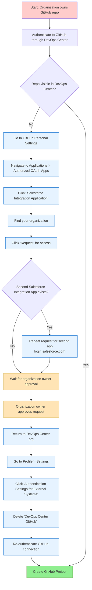

# Organization Owns the GitHub Repo

I'll fetch the page first to ensure I have all the details, then explain it in English and create a Mermaid diagram for you.I'll explain the process based on the content you provided and create a diagram to visualize it.

## Explanation: Setting Up DevOps Center with Organization-Owned GitHub Repos

This page describes the setup process for Salesforce DevOps Center when your GitHub repository is owned by an organization (rather than an individual account). The key challenge is that organization-owned repos require explicit access approval from the organization owner.

**The Process:**

1. **Initial Authentication**: You authenticate to GitHub through DevOps Center, but the org-owned repo won't be visible yet.

2. **Dual Integration Apps**: Salesforce uses two separate integration applications:
   - `test.salesforce.com` app: For development environments (scratch orgs, sandboxes)
   - `login.salesforce.com` app: For production and Developer Edition orgs

3. **Request Access**: You must manually request access to your organization's repo through **GitHub's OAuth Apps settings** for each relevant Salesforce Integration Application.

4. **Approval & Reset**: After the GitHub organization owner approves your request, you need to delete and recreate the DevOps Center GitHub authentication settings.

5. **Project Creation**: Only then can you proceed to create a GitHub project in DevOps Center.The diagram illustrates the complete workflow, highlighting that this process requires **coordination between you and your GitHub organization owner**. The key bottleneck is the approval step (shown in yellow), where the organization owner must approve your access request before you can proceed with the setup.

**Key Points:**
- Organization-owned repos add an extra layer of access control
- You may need to request access for one or both Salesforce Integration apps depending on your environment types
- The authentication must be reset after approval to properly connect the systems
- This ensures proper security governance for organization-owned repositories

