Je vais créer un diagramme Mermaid détaillé qui illustre la structure des branches Git concrètes et leur relation avec les objets DevOps Center de Salesforce.Ce diagramme Mermaid illustre la structure complète des branches Git et des objets DevOps Center. Voici les éléments clés représentés :

## **Structure Git automatique**
- **main branch** : État de production
- **Stage branches** : Une pour chaque étape du pipeline (dev, integration, uat, staging)
- **Feature branches** : Créées automatiquement pour chaque Work Item (format WI-XXXXX)

## **Objets DevOps Center**
- **Pipeline** : Définit les 5 étapes du processus de release
- **Work Items** : Unités de travail qui génèrent automatiquement les feature branches
- **Environments** : Organisations Salesforce connectées à chaque branche

## **Synchronisation bidirectionnelle**
- Chaque branche Git se synchronise avec un environnement Salesforce spécifique
- Le Source Tracking détecte automatiquement les changements dans les sandboxes
- Les APIs (Metadata, Source Tracking, GitHub) orchestrent la synchronisation

## **Points clés techniques**
1. **Aucune manipulation Git manuelle** - DevOps Center gère tout automatiquement
2. **Mapping 1:1** - Chaque étape pipeline = une branche = un environnement
3. **Progression séquentielle** - Impossible de sauter des étapes
4. **Feature branches jetables** - Supprimées après merge du Work Item

Cette architecture garantit la traçabilité complète tout en simplifiant l'expérience utilisateur, les développeurs peuvent continuer à utiliser Git directement si nécessaire.

```mermaid
graph TB
    %% Repository GitHub
    subgraph GitHub ["🐙 GitHub Repository"]
        direction TB
        
        %% Branches principales
        main["🌟 main branch<br/>(Production State)"]
        
        %% Stage branches
        staging["🚀 staging branch<br/>(Pre-production)"]
        uat["🧪 uat branch<br/>(User Acceptance)"]
        integration["🔄 integration branch<br/>(Shared Development)"]
        dev["💻 dev branch<br/>(Development)"]
        
        %% Feature branches (Work Items)
        wi001["🌿 feature/WI-00001<br/>(User Story A)"]
        wi002["🌿 feature/WI-00002<br/>(Bug Fix B)"]
        wi003["🌿 feature/WI-00003<br/>(Enhancement C)"]
        
        %% Git flow relationships
        main --> staging
        staging --> uat
        uat --> integration
        integration --> dev
        
        dev --> wi001
        dev --> wi002
        integration --> wi003
    end
    
    %% DevOps Center Objects
    subgraph DOC ["⚙️ Salesforce DevOps Center"]
        direction TB
        
        %% Pipeline Definition
        subgraph Pipeline ["📋 Pipeline: Release Pipeline"]
            direction LR
            P1["Stage 1:<br/>Development"]
            P2["Stage 2:<br/>Integration"] 
            P3["Stage 3:<br/>UAT"]
            P4["Stage 4:<br/>Staging"]
            P5["Stage 5:<br/>Production"]
            
            P1 --> P2 --> P3 --> P4 --> P5
        end
        
        %% Work Items
        subgraph WorkItems ["📝 Work Items"]
            WI1["Work Item 001<br/>Type: User Story<br/>Status: In Development"]
            WI2["Work Item 002<br/>Type: Bug Fix<br/>Status: Ready for Review"]
            WI3["Work Item 003<br/>Type: Enhancement<br/>Status: In Integration"]
        end
        
        %% Environments
        subgraph Environments ["🏢 Salesforce Environments"]
            DevSandbox["Dev Sandbox<br/>(Individual)"]
            IntSandbox["Integration Sandbox<br/>(Shared)"]
            UATSandbox["UAT Sandbox<br/>(Full Copy)"]
            StagingSandbox["Staging Sandbox<br/>(Partial Copy)"]
            Production["Production Org<br/>(Live)"]
        end
    end
    
    %% Mapping relationships - Branches to Environments
    main -.->|"🔄 Sync"| Production
    staging -.->|"🔄 Sync"| StagingSandbox
    uat -.->|"🔄 Sync"| UATSandbox
    integration -.->|"🔄 Sync"| IntSandbox
    dev -.->|"🔄 Sync"| DevSandbox
    
    %% Pipeline to Branch mapping
    P1 -.->|"Maps to"| dev
    P2 -.->|"Maps to"| integration
    P3 -.->|"Maps to"| uat
    P4 -.->|"Maps to"| staging
    P5 -.->|"Maps to"| main
    
    %% Work Items to Feature Branches
    WI1 -.->|"Creates"| wi001
    WI2 -.->|"Creates"| wi002
    WI3 -.->|"Creates"| wi003
    
    %% Work Items to Pipeline Stages
    WI1 -.->|"Currently in"| P1
    WI2 -.->|"Ready for"| P2
    WI3 -.->|"Currently in"| P2
    
    %% Source Tracking
    subgraph Tracking ["📡 Source Tracking & Sync"]
        direction LR
        ST1["Metadata API<br/>📄 Deploy/Retrieve"]
        ST2["Source Tracking API<br/>🔍 Change Detection"]
        ST3["GitHub API<br/>🔧 Git Operations"]
        
        ST1 -.-> ST2 -.-> ST3
    end
    
    %% Connection to tracking
    Environments -.->|"Monitors changes"| Tracking
    GitHub -.->|"Syncs via"| Tracking
    
    %% Deployment Flow Example
    subgraph DeployFlow ["🚀 Deployment Flow Example"]
        direction LR
        DF1["1. Developer commits<br/>to feature branch"]
        DF2["2. Creates Pull Request<br/>to dev branch"]
        DF3["3. Auto-deploy to<br/>Dev Sandbox"]
        DF4["4. Promote through<br/>pipeline stages"]
        DF5["5. Final deploy<br/>to Production"]
        
        DF1 --> DF2 --> DF3 --> DF4 --> DF5
    end
    
    %% Color styling
    classDef gitBranch fill:#e1f5fe,stroke:#01579b,stroke-width:2px
    classDef workItem fill:#f3e5f5,stroke:#4a148c,stroke-width:2px
    classDef environment fill:#e8f5e8,stroke:#1b5e20,stroke-width:2px
    classDef pipeline fill:#fff3e0,stroke:#e65100,stroke-width:2px
    classDef tracking fill:#fce4ec,stroke:#880e4f,stroke-width:2px
    
    class main,staging,uat,integration,dev,wi001,wi002,wi003 gitBranch
    class WI1,WI2,WI3 workItem
    class DevSandbox,IntSandbox,UATSandbox,StagingSandbox,Production environment
    class P1,P2,P3,P4,P5 pipeline
    class ST1,ST2,ST3 tracking

```

